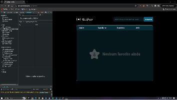

# GitHub Favorites

Gerencie seus usuários favoritos do GitHub, mantendo-se atualizado com seus repositórios e seguidores. Acesse rapidamente seus perfis com este prático aplicativo.

## Demonstração

## Visão Geral

Este projeto foi desenvolvido como parte de um estudo sobre consumo de APIs, utilizando a técnica de fetch para interagir com a API do GitHub. Além disso, exercitamos o uso de promessas para lidar com requisições assíncronas. Utilizamos também o localStorage para armazenar informações dos usuários favoritos.

## Funcionalidades

- Adicionar usuários favoritos do GitHub
- Visualizar detalhes como repositórios e seguidores
- Acesso rápido aos perfis dos usuários
- Armazenamento local dos usuários favoritos

## Como Usar

1. Clone este repositório em sua máquina local.
2. Abra o arquivo `index.html` em seu navegador.
3. Digite o nome de usuário do GitHub que deseja favoritar na barra de pesquisa.
4. Clique no botão "Favoritar" para adicionar o usuário à lista.
5. Para remover um usuário, clique no botão "Remover" ao lado de seu nome na lista.

## Tecnologias Utilizadas

- HTML
- CSS
- JavaScript

## Autor

Paulo Alex

## Contribuição

Contribuições são sempre bem-vindas! Sinta-se à vontade para abrir uma issue ou enviar um pull request.

## Licença

Este projeto está licenciado sob a [Licença MIT](LICENSE).
